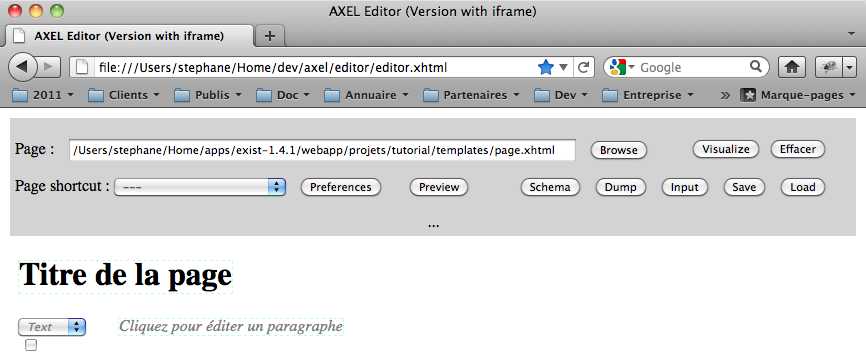
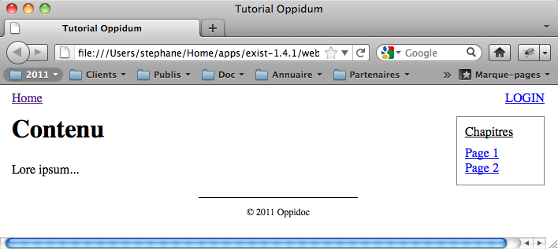

Faire un site Web avec Oppidum
==============================

Par Stéphane Sire

Version du 10 novembre 2011

Ce document présente une méthode de travail à suivre pour créer des sites Web avec Oppidum. Il s'appuie sur l'application __tutorial__ qui l'accompagne. 

Le tutorial est un mini-site avec 1 page d'accueil `/home` éditable, et un catalogue `/chapitres/{nb}` dans lequel il est possible d'ajouter et de modifier des pages identifiées par un numéro. 

Toutes les pages utilisent le même gabarit avec un lien vers l'accueil (sauf sur l'accueil), un lien Login/Logout et un menu vers les chapitres à droite. Le gabarit inclus également une zone pour afficher des erreurs et une zone pour afficher des message d'information.

Seul l'utilisateur admin, ou membre (mot de passe *test*) sont autorisés à modifier / ajouter des pages. Les pages utilisent toutes le même template XTiger XML qui permet de télécharger des images.

Le premier chapitre “Installation et lancement du tutorial” explique comment lancer le tutorial et donne quelques conseils sur l'environnement de développement. Les chapitres suivants expliquent pas à pas comment le tutorial a été créé. C'est la même démarche qu'il faut suivre pour créer un nouveau site Web avec Oppidum. 

Installation et lancement du tutorial
-------------------------------------

###Pré-requis###

####Base de données eXist####

Vous devez installer [eXist](http://www.exist-db.org/) (version 1.4.1). Au cours de l'installation eXist vous demandera de choisir le répertoire où il créera le répertoire `data` contenant toute la base de données (vous pouvez laisser le choix par défaut). Il vous demandera également de fixer le mot de passe de l'utilisateur `admin`. 

> Attention si vous installez plusieurs BD eXist en même temps, ne mettez pas leurs base de données au même endroit, vous risquez ensuite d'avoir un message d'erreur lors du lancement d'eXist à propos de problèmes de *locks*.

####Librairie Javascript AXEL####

Nous vous recommandons d'installer la distribution d'AXEL quelque part sur votre ordinateur pour mettre au point les templates XTiger XML. Celle-ci est disponible sur [GitHub](https://github.com/ssire/axel). Utilisez la commande `git` pour la récupérer:

      git clone git://github.com/ssire/axel.git
      
ou bien récupérez directement une archive .ZIP à l'aide du bouton *ZIP* sur la page du projet sur GitHub si vous n'avez pas la commande Git et ne souhaitez pas l'installer.

Lorsque la distribution AXEL est installée, ouvrez le fichier `editor/editor.xhtml` dans Firefox. Suivez alors les instructions affichées pour modifier `security.fileuri.strict_origin_policy` et le mettre à `false`. Vous pourrez alors utiliser les boutons *Browse*, *Save* et *Load* pour choisir un fichier template XTiger XML à transformer dans l'éditeur, sauvegarder les données XML en cours d'édition dans un fichier et charger des données XML depuis un fichier dans l'éditeur (attention cette dernière fonction est à effectuer 1 seule fois après la transformation du template choisi en éditeur).

Par exemple essayez d'ouvrir le template `templates\page.xhtml` du tutorial (appuyez sur *Visualize* pour le transformer), vous devriez obtenir quelque chose comme la figure suivante :

   
  Test du template “templates/page.xhtml” du tutorial avec l'éditeur d'AXEL

  

####Éditeur(s) de texte####

Pour les utilisateurs de Macintosh nous recommandons d'utiliser l'éditeur de texte [TextMate](http://macromates.com/) (payant) ou à défaut [TextWrangler](http://www.barebones.com/products/textwrangler/) (gratuit). Ces deux éditeurs sont très pratiques car ils permettent d'accéder à l'arborescence de l'ensemble d'un répertoire si celui-ci est ouvert par glisser-déposer de l'icone du répertoire sur celle de l'éditeur.

Pour TextMate il est possible d'installer un bundle XQuery qui reconnaît la syntaxe XQuery (très pratique). Le bundle est disponible par svn sur  `http://svn.textmate.org/trunk/Review/Bundles/XQuery.tmbundle/`.
    
Pour l'installer vous pouvez exécuter dans le terminal :
    
    cd  ~/Library/Application\ Support/TextMate/
    mkdir Bundles (ssi il n'existe pas)
    cd Bundles
    svn  --username anon --password anon co "http://svn.textmate.org/trunk/Review/Bundles/XQuery.tmbundle/"
    osascript -e 'tell app "TextMate" to reload bundles'

Ensuite il faut associer les fichiers XQuery (extensions `.xql` ou .xqm`) avec le bundle. Pour cela, lorsqu'un fichier XQuery est ouvert, associez le manuellement à l'aide du popup du bas de la fenêtre TextMate. Cette association sera valable pour tous les fichiers avec la même extension.

Il est également possible d'installer pour TextMate un plugin [XMLMate](http://ditchnet.org/xmlmate/) qui offre une palette dans le menu *Window* qui peut servir à évaluer des XPath sur le fichier XML ouvert dans la fenêtre de premier plan. De même le plugin [TeXSLMate](http://ditchnet.org/texslmate/) offre une palette pour debugger les scripts XSLT / XQUery (mais sans les modules propres à eXist). Dans les deux cas double cliquez sur le fichier `.plugin` pour l'installer dans TextMate.

Sinon vous pouvez également utiliser l'éditeur [Oxygen](http://www.oxygenxml.com/) (payant). Dans ce cas nous vous recommandons également de suivre les instruction pour [configurer une connection eXist](http://www.oxygenxml.com/doc/ug-editor/tasks/configure-exist-connection.html) qui vous permettra de voir directement le contenu de la BD dans l'éditeur Oxygen.

###Lancement###

Installez eXist. Dans le répertoire `webapp` de eXist créez un répertoire `projets`. Dans le répertoire `projet`, placez le répertoire `oppidum` de la distribution Oppidum, et placez à côté le répertoire `tutorial` de la distribution du tutorial. Si le répertoire où vous avez installé eXist s'appelle `exist-1.4.1`, vous devriez obtenir l'arborescence suivante : 

    $ ls -1 projets/
    oppidum
    tutorial
    $ pwd
    {...}/exist-1.4.1/webapp

Vous pouvez alors lancer eXist avec la procédure standard ou bien en exécutant le script `start.sh` qui se trouve dans le répertoire `oppidum/scripts` à l'aide du terminal :

    $cd projets/oppidum/scripts/
    $ ./start.sh 
    Starting eXist server with output redirected to 'server.log'

Vous pouvez alors accéder au tutorial avec l'URL :

    http://localhost:8080/exist/projets/tutorial
    
lors du premier accès vous devriez obtenir une erreur indiquant que le *mesh* n'est pas dans la base de données. C'est parce qu'il faut d'abord installer les données initiales du site dans la BD (cf. ci-dessous).

L'intérêt d'installer Oppidum et le tutorial dans sous-répertoire `projets` est que cela vous permet d'accéder ensuite à l'aide d'eXist pendant le développement, en particuliers aux URLs suivantes très pratiques:

    http://localhost:8080/exist (documentation)
    http://localhost:8080/exist/sandbox (sandbox pour tester du code XQuery)
    http://localhost:8080/exist/xquery/functions.xql (annuaire des fonctions XQuery)

###Installation des données initiales du site dans la BD###

Lorsque eXist est lancé, ouvrez l'URL suivante :

    http://localhost:8080/exist/projets/tutorial/install
    
Il faudra alors vous identifier comme admin avec le mot de passe défini lors de l'installation de eXist.     

   
  Page d'installation du site tutorial

  

Dans la ligne *Data :* sélectionnez alors tous les modules (default, config, data, mesh et templates), puis cliquez sur le bouton *Install*. Vous devriez ensuite pouvoir utiliser normalement l'application tutorial. 

Notez que la ressource `/install` est utilisable seulement en développement, elle doit être normalement désactivée en production.

###Arrêt###

Utilisez la procédure standard de eXist ou bien exécutez le script `stop.sh` qui se trouve dans le répertoire `oppidum/scripts` à l'aide du terminal. Dans ce deuxième cas pensez à éditer le fichier `stop.sh` de manière à placer le mot de passe que vous avez attribué à la BD eXist lors de l'installation, par ex. dans le cas suivant le mot de passe est *test* :

     $ more stop.sh  
     echo "Shutting down eXist server"       
     ../../../../bin/shutdown.sh -u admin -p test
     
Notez (idem pour le lancement) que les scripts `start.sh` et `stop.sh` ne fonctionnent que si Oppidum est installé dans un sous-répertoire (e.g. `projets`) du répertoire `webdav`.
     
     
###Accès au contenu de la BD###

Lorsque eXist est lancé vous pouvez accéder au contenu de la base de données de plusieures manières :

  1. afficher le contenu de la BD en lecture seule avec le navigateur Web en ouvrant des URLs de la forme :

        http://localhost:8080/exist/rest/db

  2. utiliser le client Java d'administration de eXist

  3. avec la connexion eXist dans l'éditeur Oxygen (cf. ci-dessus)

Les deux dernières méthodes permettent aussi de créer des collections et des ressources, et de modifier les droits d'accès.

Notez que la première méthode peut ne pas fonctionner si l'on a modifié la configuration de eXist pour empêcher l'accès au contenu de la BD, ce qui devrait être le cas en production.    

Première étape : la configuration du site
------------------------------------

La configuration du site est un ensemble de fichiers et de données qui se trouvent dans le répertoire de l'application et qui servent à initialiser la base de données du site pour qu'elle puisse fonctionner avec Oppidum.

Elle comporte les éléments suivants :

- des ressources (fichiers CSS, Javascript, etc.)
- un ou plusieurs gabarits
- des messages d'erreur localisés
- des contenus de page initiaux
- des tempales XTiger XML pour éditer les pages

Tous ces éléments sont recopiés dans la base de données par un script d'installation.

###Les ressources###

Par convention créez un répertoire `resources` dans lequel vous placerez les ressources statiques du site dans des sous-répertoires, par exemple `css` ou  `lib` (pour le code Javascript) ou `images` (pour les images utilisées dans les gabarits).

Le tutorial contient une unique ressource `site.css` placée dans le répertoire `resources/css`.

###Le gabarit###

Le gabarit (ou __mesh__) est un fichier XHTML qui définit le présentation finale de une ou plusieurs pages du site incluant tous les éléments navigationnels et informatifs (chemin de navigation, menus, en-tête, pied de page, etc.).

Il peut exister un ou plusieurs gabarits pour un site Web (ex: un gabarit pour les pages standards et un gabarit pour les erreurs de page non trouvées). Le nom du fichier (sans le suffixe) correspond au nom de l'attribut `@epilogue` utilisé dans le _mapping_ du site.

Le tutorial contient un unique gabarit `standard.html` dans le répertoire `mesh`. Ce fichier contient des éléments spéciaux dans l'espace de nommage `xmlns:site="http://oppidoc.com/oppidum/site"`. Chaque site est libre de définir son propre vocabulaire. 

Ouvrez directement le gabarit depuis le système de fichier dans votre navigateur sans lancer le serveur. Vous devriez voir quelque chose ressemblant à l'illustration suivante :

   
  Test du gabarit du site “mesh/standard.html” avec Firefox

  

Lors du rendu du gabarit, chaque élément spécial est remplacé soit par le contenu correspondant de la vue transmise à l'épilogue (c-a-d le document `<site:view>`), soit par le résultat d'une fonction XQuery de même nom définie dans l'épilogue, soit supprimé.

Par exemple dans le gabarit `standard.html` du tutorial, le contenu de la page est généré par l'élément spécial `<site:content>` :

    

      <site:content>
        <h1>Contenu</h1>
        
Lore ipsum...

      </site:content>
    

    
Si la vue transmise à l'épilogue contient :

    <site:view>
      <site:content>
        
Hello World

      </site:content>
    </site:view>

La page rendue par l'épilogue contiendra :

    

      
Hello World
    
    

    
Et si elle ne contient pas d'élément `<site:content>`, le résultat sera:

    

    

Comme le montre l'illustration ci-dessus, il est permis de mettre du contenu HTML sous les éléments spéciaux du gabarit. Ceci est très pratique lors de l'intégration d'un site Web pour __tester__ le gabarit en l'ouvrant directement dans un navigateur Web. Ce contenu ne sera pas repris par l'épilogue.

Ainsi le gabarit `standard.html` du tutorial contient un fragment `<site:link>` conçu pour inclure le fichier CSS du site : 

    <site:link force="true">  
    	<link rel="stylesheet" href="../resources/css/site.css" type="text/css" charset="utf-8"/>
    </site:link>
    
Le lien relatif vers le fichier CSS sert ici uniquement à tester le gabarit comme expliqué ci-dessus, puisqu'il ne sera pas recopié par l'épilogue. 

L'attribut `force="true"` placé sur l'élément spécial du gabarit force l'appel de la méthode que la vue contienne ou non un fils de même nom.

Si vous parcourez le fichier `epilogue.xql` du tutorial, vous constaterez que la plupart des modules du gabarit sont en fait générés dynamiquement par des fonctions XQuery dans l'épilogue (c'est la cas du chemin de navigation `Home`, du lien `LOGIN` ou du menu `Chapitres` par ex).

Le gabarit du tutorial contient également des éléments `div` avec un attribut `condition` pour générer des boites pour afficher les messages d'erreur ou les messages d'informations créés par les méthodes `oppidum:add-error` et `oppidum:add-error` lors de l'exécution du pipeline.

Par exemple pour les messages d'erreur, le fragment : 

    
 
      <site:error force="true"/>
    

appelle la fonction `site:error` de l'épilogue quel que soit le contenu de la vue (attribut `force="true"`). Par contre la condition `has-error` n'insère la div que s'il y a des erreurs.

###Les messages d'erreur###

La configuration du site comprend également le texte des messages d'erreur dans un fichier XML conventionnellement appelé `errors.xml` et qui se trouve dans le répertoire `init`. Pour chaque type d'erreur, ce fichier comprend un enregistrement de la forme :

    <error type="URI-NOT-FOUND" code="404">
      <message lang="fr">La page demandée n'existe pas</message>
      <message lang="en">Page does not exist</message>
    </error>

Le tutorial n'ajoutant pas de type d'erreur supplémentaire à ceux définis par défaut par Oppidum, il n'a pas de fichier d'erreurs.

###Les contenus de pages initiaux###

Vous pouvez également fournir des contenus initiaux pour les pages du site. Par convention nous recommandons de placer ces contenus dans un répertoire `init`. Dans le cas du tutorial celui-ci contient une seule page initiale `home.xml`.

###Les templates XTiger XML###

Les templates sont par convention dans le répertoire `templates`.

Suivant les cas il se peut que vous deviez installer les templates dans la base de données pour pouvoir les utiliser en développement (en test et en production ils seront toujours dans la BD). Dans ce cas ils font partie de la configuration du site. 

C'est le cas dans le tutorial où le seul template `page.xhtml` doit être servi après transormation par la transformation XSLT `templates/filter.xsl`. Le but de cette transformation est d'ajouter un paramètre `photo_base` qui sert à afficher les images téléchargées pendant l'édition, et dont l'URL dépend du contexte d'exécution de l'application (paramètre `xslt.base-url`).

###Le script d'installation###

Le script d'installation copie la configuration du site dans la BD. Par convention le script d'installation est un script XQuery appelé `install.xql` à placer dans le répertoire `scripts`. Ce script est invoqué par une ressource *`/install`* déclarée dans le mapping (cf. infra).

Le script d'installation du tutorial copie la configuration dans une collection mère `/db/sites/tutorial` dans la BD.

Notez que le script d'installation crée aussi le ou les premiers utilisateurs et met les droits d'accès sur les collections et les ressources de la BD. 

Le script d'installation copie aussi le code de l'application dans une collection mère `/db/www/tutorial`, mais ce n'est pas nécessaire en développement où le code est exécuté depuis le répertoire sur disque de l'application.

Le script d'installation consiste en réalité en 1 seule ligne qui invoque une fonction fournie par Oppidum : 

    install:install("projets/tutorial", $policies, $site, $code, "Tutorial")
    
Le premier paramètre indique le chemin jusqu'au tutorial depuis le répertoire `webapp` de eXist.
  
La description des utilisateurs, des collection, des ressources à créer et des permissions associées s'effectue de manière déclarative dans les trois variables `$policies`, `$site`, `$code` dans le namespace `"http://oppidoc.com/oppidum/install"`. Elle suit un syntaxe expliquée dans le guide d'Oppidum.

Le dernier paramètre est le titre de la fenêtre.

Deuxième étape : l'épilogue
----------------

L'epilogue est le fichier **`epilogue.xql`** du tutorial. Chqaue application Oppidum doit définir un tel fichier à la racine.

###Structure de l'épilogue###

L'epilogue contient une fonction récursive (`local:render`, à recopier toujours telle qu'elle) qui recopie les noeuds XHTML du gabarit et passe le contrôle à une fonction XQuery dès qu'elle rencontre un élément spécial dans l'espace de nom `site:`. Dans ce cas elle n'itère pas sur les fils de cet élément spécial. La fonction XQuery doit retourner un fragment HTML à inclure dans la page, éventuellement vide.

L'association entre les éléments spéciaux et les fonctions XQuery s'effectue dans la fonction d'aiguillage : 

    declare function site:branch( $cmd as element(), $source as element(), $view as element()* ) as node()*

La création de l'épilogue se résume à créer les fonctions de rendu associées avec chaque élément spécial du gabarit. Dans la suite de cette section nous reprenons brièvement les fonctions utilisées dans le tutorial. Chaque application est libre de définir les fonctions qui lui conviennent en fonction des gabarits qu'il utilisés.

###Ajouter des liens vers les CSS###

Le tutorial définit une fonction `site:link` pour générer l'élément `<site:link>` du gabarit :

    declare function site:link( $cmd as element(), $view as element() ) as element()*1
    
Cette fonction retourne un ou plusieurs liens CSS générés dynamiquement suivant la commande (donc la page courante). Elle utilise la fonction `epilogue:css-link` d'Oppidum pour intégrer des liens vers les fichiers CSS de la librairie AXEL ou jQuery fournies en standard avec Oppidum, ou bien vers les fichiers CSS contenus dans le répertoire `resources` du tutorial.

###Ajouter des scripts Javascripts####

Le tutorial définit une fonction `site:scripts` semblable à la fonction `site:link` mais pour les scripts Javascript à inclure dans la page. 

Cette fonction utilise la fonction `epilogue:js-link` d'Oppidum pour intégrer des liens vers la librairie AXEL ou jQuery fournies en standard avec Oppidum, ou bien vers les fichiers Javscript contenus dans les ressources du tutorial.

###Créer un menu de navigation primaire####

Le tutorial définit une fonction `site:navigation` pour générer l'élément `<site:menu>` du gabarit. Celle-ci interroge le contenu de la collection `/db/sites/tutorials/chapters` pour générer un lien vers chaque chapitre. Elle met également en gras le chapitre courant si la commande concerne une page de chapitre.

###Créer un chemin de navigation###

Le tutorial définit une fonction `site:home` pour générer l'élément `<site:home>` du gabarit. Celle-ci affiche un lien vers la page d'acueil si la commande concerne tout autre page.

###Créer un bouton login###

Le tutorial définit une fonction `site:login` pour générer l'élément `<site:login>` du gabarit. Cette fonction gère l'affichage du lien Login ou Logout et du nom de l'utilisateur courant.

Troisième étape: le contrôleur
------------------

Le contrôleur principal du tutorial est le fichier **`controller.xql`**. Chaque application Oppidum doit définir un tel fichier à la racine.

En pratique le contrôleur se résume à une ligne :

    gen:process($exist:root, $exist:prefix, $exist:controller, $exist:path,
        'fr', true(), $access, $actions, $mapping)
        
Cette commande passe le contrôle à Oppidum avec les informations suffisantes pour analyser la requête du client (contenue dans les variables pré-définies d'aXist `exist:root`, `exist:controller` et `exist:path`) et générer en retour un pipeline.        

L'architecture et une partie de la logique de l'application Web est transmise au contrôleur dans les variables `$mapping`, `$actions` et `$access`. 

Ces variables décrivent respectivement : 

  - le *mapping* REST du site sous forme de collections, de resources et d'actions
  - des actions par défaut (sucre syntaxique pour simplifier le mapping) 
  - des règles d'accès

La syntaxe XML de ces variables est définie dans le guide d'Oppidum.

Quelques “pipelines” standards
------------------------------

###Afficher une ressource###

Le plus simple est d'utiliser les attributs `db`, `collection` et `resource` du mapping pour faire pointer l'objet de référence de la commande sur la  resource à afficher :

    <site db="/db/sites/tutorial"...
      <item name="home" collection="pages" resource="home.xml"...>

Utilisez ensuite le script XQuery `oppidum:actions/read.xql` comme modèle. Si la ressource contient directement le HTML à insérer dans la page vous pouvez également utiliser la transformation XSLT `oppidum:views/dump.xsl` :

      <model src="oppidum:actions/read.xql"/>
      <view src="oppidum:views/dump.xsl"/>
      
Si votre ressource doit-être convertie en HTML pour l'affichage, remplacez la transformation XSLT pour votre propre transformation. Il est d'usage de mettre celle-ci dans le répertoire `views` de votre application :

    <view src="views/ma-transformation.xsl"/>
    
Si la resource que vous souhaitez afficher ainsi est désignée comme item anonyme de collection par l'URL, vous pouvez utiliser la même méthode que ci-dessus mais en utilisant la substitution d'URL dans la syntaxe de l'attribut `resource`. Par exemple si votre URL est de la forme `chapitre/num` où _num_ sert à construire le nom du fichier contenant la resource en ajoutant le suffixe _.xml_, utilisez `$2` (2e segment du chemin de l'URL) pour fabriquer le nom du fichier :

    <site db="/db/sites/tutorial"...>
      <collection name="chapitres" collection="chapitres"...>
        <item resource="$2.xml"...>
        
et utilisez ensuite les mêmes types de pipeline que ci-dessus pour afficher la ressource.

A MIGRER DANS LE GUIDE OPPIDUM

Vous pouvez également remplacer le script XQuery servant de modèle par votre propre script. Dans ce cas la méthode `path-to-ref` du module `http://oppidoc.com/oppiudm/util` renvoie dans une chaine de caractère le chemin d'accès à l'objet de référence de la requête, et la méthode `path-to-ref-col` une référence à sa collection : 

    let $doc-uri := oppidum:path-to-ref()
    let $col-uri := oppidum:path-to-ref-col()
    

###Modifier une ressource###

À faire

###Ajouter une ressource###

À faire

###Télécharger une image###

À faire

Packaging et mise en test et en production
--------

Le packaging consiste à créer une *archive .ZIP* contenant à la fois la configuration et le code de l'application.

C'est cette archvive qui sera restorée dans la base de donnée pour installer l'application sous Tomcat en test ou en production.

A EXPLIQUER

En production penser à désactiver l'accès au contenu de la BD par le ExistServlet.

